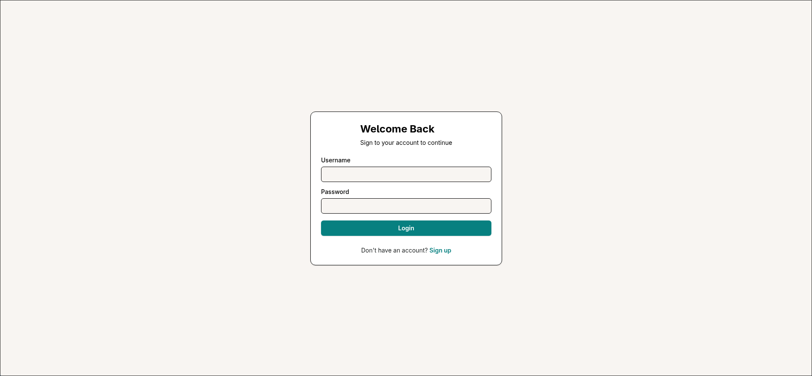
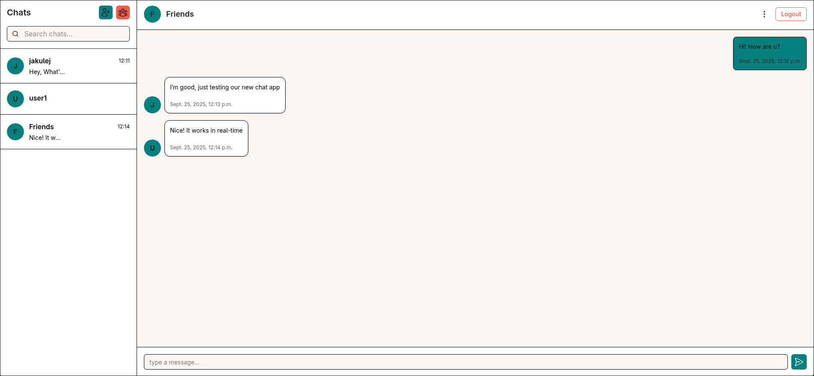
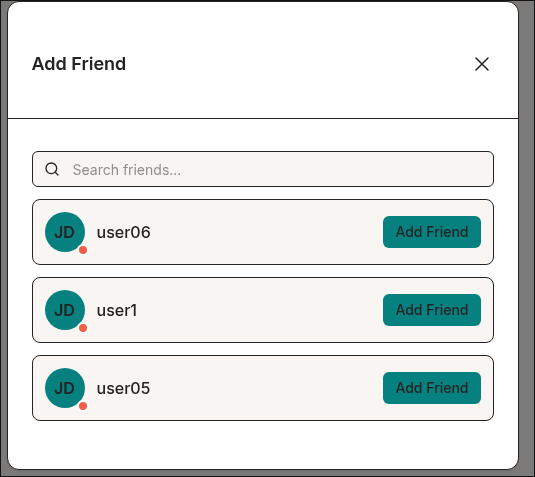
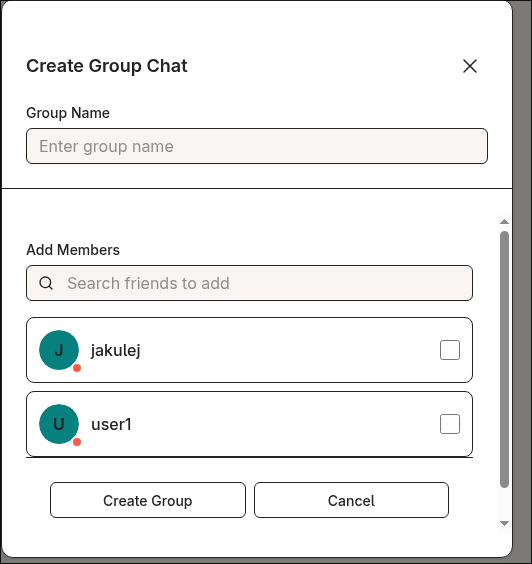

# Chat App

## Project Description
A real-time chat application built with Django and WebSockets.  
Users can create accounts, log in, and exchange messages inside chat rooms.  

## Features
- User registration and authentication  
- Real-time messaging via WebSockets  
- Multiple chat rooms support  
- Message history stored in the database  
- User account management (`accounts` app)  
- Simple and clean web interface  

## Tech Stack
- **Backend**: Django, Django Channels  
- **Frontend**: HTML, CSS, JavaScript, Tailwind 
- **Database**: PostgreSQL  

## Getting Started

### 1. Clone the repository
```bash
git clone https://github.com/your-username/chat-app.git
cd chat-app
```
### 2. Run the app
```bash
cd chatapp
docker compose up
```
### 3. Open in browser
` http:localhost:8000 '

## Screenshots




